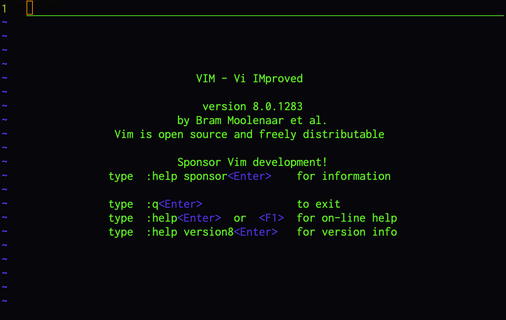

#VIM Editor   
  
###1. Introduction  
`MacOS`  
In the terminal, input  
在Mac系統下，使用終端機輸入  
```bash
vim
```
We will see a starting screen as the following picture  
成功進入vim後，會顯示起始畫面，如下圖  
  

There are 2 main modes we have to know before we're starting to edit with vim:  
在使用vim編輯器前，我們必須先瞭解兩個主要的模式  
1. __*Command Mode*__ [命令模式]  
   To Save, Quit, Copy, Paste, Goto, etc. We have to do most things in this mode except coding. It's a preset activation while we start the vim.  
   除了寫入文字外，存擋、退出、複製、貼上、前往等等的命令，都必須在此模式下完成，同時這也是啟動後的預設模式。  
2. __*Edit Mode*__ [編輯模式]  
   Also known as the `INSERT` mode. In this mode coding is the only reason,We can hit `i` to activate, and hit `Esc` to go back to the Command Mode.  
   同時也稱作`添寫`模式，按下鍵盤上的`i`即可進入，在此模式唯一能做的事就是寫入代碼，或是利用`Esc鍵`返回命令模式。  

###2. Basic Command
>GUI: Graphic User Interface  
>   +GUI Editors: Atom, Sublime...  
>CLI: Command Line Interface  
>   +CLI Editors: Vim, Nano...  

In the `Command Mode`, If we hit `:` then we can key following alphabets to save or quit the file.  
+ Written(Save) `:w`  
+ Quit `:q`  
+ Written and Quit `:wq` (the order is important, save[w] then terminate[q].)  
+ Quit without save `:q!`(force to quit)  
  
####[Shortcut]  
(If you inputed something wroung before you finished command, hit `Esc` to reset)  
0. redo last command(exclude: __moving__ and __:command__): `.`  
1. ⬅︎:`h` ⬇︎:`j` ⬆︎:`k` ➡︎:`l` to move cursor  
2. Move to the next Word:`w` Back to the last Word:`b`  
3. PageUP(fn+⬆︎):`⌃+f` PageDown(fn+⬇︎):`⌃+b`  
4. Goto:`lineNum+gg`, e.g. goto line 100 `100gg`  
5. From cursor line to the next/last 20 lines:`20k` / `20j`  
6. find:`/keyword`, e.g. looking for __foo__:`/foo`, hit `n` and `Shift+n` to move between differnt __foo__  
7. Delet/Cut cursor line:`cc`
8. Delet/Cut following line with cursor line, e.g. We are going to delete [line 30] from [line 20], move cursor to line 20 through `20gg`, and then we keying `10cc` or `c10c`, both way are fine.  
9. Copy cursor line: `yy`  
10. Copy following line with cursor line, e.g. We are going to Copy [line 30] from [line 20], move cursor to line 20 through `20gg`, and then we keying `10yy` or `y10y`, both way are fine.  
11. `y^`/`y0`  複製至行首，不含游標所在處字元。`y$`  複製至行尾，含游標所在處字元。`yw`  複製一個 word。`y2w` 複製兩個字。`yG`  複製至檔尾。`y1G` 複製至檔首。  
12. Paste: `p` paste after cursor, `P` paste before cursor.  
13. Undo`u`  
14. Visual Mode:`v` to select multiple lines, with `c` to delete.  
15. Auto-complete `ctrl+n` with `ctrl+p` to switch.  
16. 
