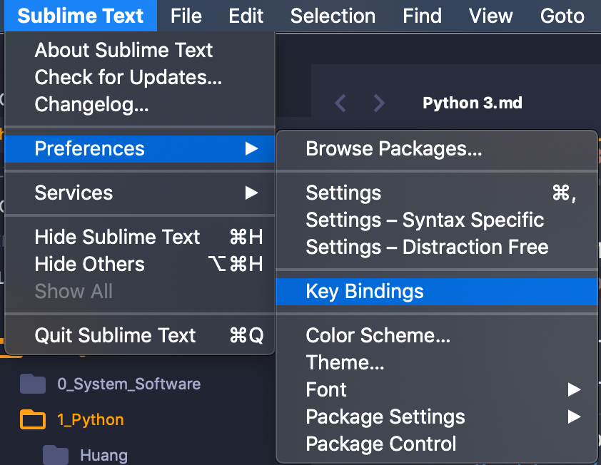

# Python 3 Develop Environment  
<p align="right""> by <a href="https://github.com/Ron-Chang">Ron Chang</a></p>  

### Install (Mac OS):  
1. `⌘ + Space`, Input `Terminal` .
2. Follow the instruction to install [Homebrew](https://brew.sh)  
3. Use 'brew' command to install python3. `brew install python3`  
4. Install `Sublime` and install [Package Control](https://packagecontrol.io/installation)  
5. Set a python3 environment for Sublime Text, hit `New Build System...` . 
6. Following the step 5, named the file as python372.sublime-build.  
*__Attention: "/usr/local/opt/python/bin/python3.7"__*  
The path depends on where you install your python3.  
You can check it in `terminal`, key in `which python3`  
__*Don't forget to tick `python372` in `Tools` -> `Build System`, after you built it.*__  

```json
{
    "cmd": ["/usr/local/opt/python/bin/python3.7", "-u", "$file"],
    "file_regex": "^[ ]*File \"(...*?)\", line ([0-9]*)",
    "selector": "source.python"
}
```
  
7. Install `SublimeREPL` and set up key mapping.  
`F5` to Excute the current python file.  
`⌘ + F5` to open IDLE.
  

```json
[
{ "keys": ["f5"], "command": "run_existing_window_command", "args":
    {"id": "repl_python_run","file": "config/Python/Main.sublime-menu"
    }
},

{ "keys": ["command+f5"], "command": "run_existing_window_command", "args":
    {"id": "repl_python","file": "config/Python/Main.sublime-menu"
    }
},

]
```
  
8. Restart `Sublime Text`.  

If nothing goes wrong, hit `⌘ + F5` you will see IDLE running as 3.7.2, instead of 2.x.x .

