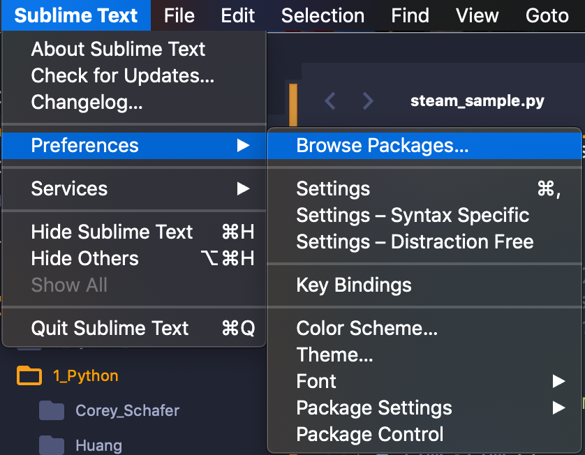

# Python 3 Develop Environment  
<p align="right""> by <a href="https://github.com/Ron-Chang">Ron Chang</a></p>  

### Install (Mac OS):  
##### 1. `⌘ + Space`, Input `Terminal` .
##### 2. Follow the instruction to install [Homebrew](https://brew.sh)  
##### 3. Use 'brew' command to install python3. `brew install python3`  
##### 4. Install `Sublime` and install [Package Control](https://packagecontrol.io/installation)  
##### 5. Set a python3 environment for Sublime Text, hit `New Build System...` . 
##### 6. Following the step 5, named the file as python372.sublime-build.  
*__Attention: "/usr/local/opt/python/bin/python3.7"__*  
The path depends on where you install your python3.  
You can check it in `terminal`, type in `which python3` and press `Return`.  
__*Don't forget to tick `python372` in `Tools` -> `Build System`, after you built it.*__  

__\* Step 5 & 6 are setup for runnig sublime default enviroment by `⌘+B` \*__  

```json
{
    "cmd": ["/usr/local/opt/python/bin/python3.7", "-u", "$file"],
    "file_regex": "^[ ]*File \"(...*?)\", line ([0-9]*)",
    "selector": "source.python"
}
```
  
##### 7. Install `SublimeREPL` from `package control` by `⌘Command+⇧Shift+p` and setup the key mapping.  
`F5` to Excute the current python file.  
`⌘ + F5` to open IDLE.
  

```json
[
{ "keys": ["f5"], "command": "run_existing_window_command", "args":
    {"id": "repl_python_run","file": "config/Python/Main.sublime-menu"
    }
},

{ "keys": ["command+f5"], "command": "run_existing_window_command", "args":
    {"id": "repl_python","file": "config/Python/Main.sublime-menu"
    }
},

]
```
  
##### 8. Connect the python3 path for SublimeREPL as step 5 and step 6  
In `Finder` Press `⌘Command+⇧Shift+g` and paste the directory.  
Default Directory:`~/Library/Application Support/Sublime Text 3/Packages/SublimeREPL/config/Python/`  
or `Sublime Text` -> `Preferences` -> `Browse Packages...`  
  
Go `SublimeREPL` -> `config` -> `Python`  

##### 9. Create or modify `Main.sublime-menu` with the following settings  
__Attention: "/usr/local/opt/python/bin/python3.7"__  
The path depends on where you install your python3.  
You can check it in `terminal`, type in `which python3` and press `Return`.  
```json
[
     {
        "id": "tools",
        "children":
        [{
            "caption": "SublimeREPL",
            "mnemonic": "R",
            "id": "SublimeREPL",
            "children":
            [
                {"caption": "Python",
                "id": "Python",

                 "children":[
                    {"command": "repl_open",
                     "caption": "Python",
                     "id": "repl_python",
                     "mnemonic": "P",
                     "args": {
                        "type": "subprocess",
                        "encoding": "utf8",
                        "cmd": ["/usr/local/opt/python/bin/python3.7", "-i", "-u"],
                        "cwd": "$file_path",
                        "syntax": "Packages/Python/Python.tmLanguage",
                        "external_id": "python",
                        "extend_env": {"PYTHONIOENCODING": "utf-8"}
                        }
                    },
                    {"command": "python_virtualenv_repl",
                     "id": "python_virtualenv_repl",
                     "caption": "Python - virtualenv"},
                    {"command": "repl_open",
                     "caption": "Python - PDB current file",
                     "id": "repl_python_pdb",
                     "mnemonic": "D",
                     "args": {
                        "type": "subprocess",
                        "encoding": "utf8",
                        "cmd": ["/usr/local/opt/python/bin/python3.7", "-i", "-u", "-m", "pdb", "$file_basename"],
                        "cwd": "$file_path",
                        "syntax": "Packages/Python/Python.tmLanguage",
                        "external_id": "python",
                        "extend_env": {"PYTHONIOENCODING": "utf-8"}
                        }
                    },
                    {"command": "repl_open",
                     "caption": "Python - RUN current file",
                     "id": "repl_python_run",
                     "mnemonic": "R",
                     "args": {
                        "type": "subprocess",
                        "encoding": "utf8",
                        "cmd": ["/usr/local/opt/python/bin/python3.7", "-u", "$file_basename"],
                        "cwd": "$file_path",
                        "syntax": "Packages/Python/Python.tmLanguage",
                        "external_id": "python",
                        "extend_env": {"PYTHONIOENCODING": "utf-8"}
                        }
                    },
                    {"command": "repl_open",
                     "caption": "Python - IPython",
                     "id": "repl_python_ipython",
                     "mnemonic": "I",
                     "args": {
                        "type": "subprocess",
                        "encoding": "utf8",
                        "autocomplete_server": true,
                        "cmd": {
                            "osx": ["/usr/local/opt/python/bin/python3.7", "-u", "${packages}/SublimeREPL/config/Python/ipy_repl.py"],
                            "linux": ["/usr/local/opt/python/bin/python3.7", "-u", "${packages}/SublimeREPL/config/Python/ipy_repl.py"],
                            "windows": ["/usr/local/opt/python/bin/python3.7", "-u", "${packages}/SublimeREPL/config/Python/ipy_repl.py"]
                        },
                        "cwd": "$file_path",
                        "syntax": "Packages/Python/Python.tmLanguage",
                        "external_id": "python",
                        "extend_env": {
                            "PYTHONIOENCODING": "utf-8",
                            "SUBLIMEREPL_EDITOR": "$editor"
                        }
                    }
                    }
                ]}
            ]
        }]
    }
]

```
##### 10. Restart `Sublime Text`.  

If nothing goes wrong, hit `⌘ + F5` you will see IDLE running as 3.7.2, instead of 2.x.x .


#### Something Else:  
[__Fix Omni markup Previewer Error__](https://github.com/timonwong/OmniMarkupPreviewer/issues/85#issuecomment-168078270)  
