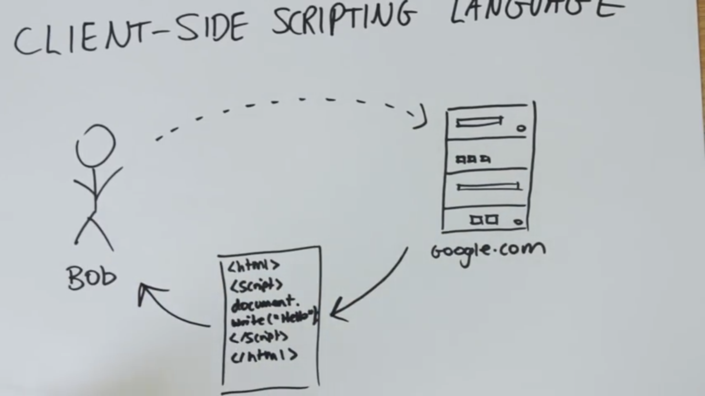
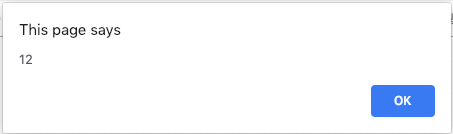
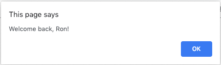

# Javascript  
<p align="right""> by <a href="https://youtu.be/Ukg_U3CnJWI/">Jake Wright</a></p> 

## Ｗhat is Javascript?  
<p align="center"><br></p>  

1. Javascript is a `CLIENT-SIDE SCRIPTING LANGUAGE`.
2. Let users to process the webpage.
3. `Javascript != Java`
  
Sample:  
```html
<!DOCTYPE html>
<html lang="en">
<head>
    <meta charset="UTF-8">
    <title>Javascript</title>
</head>
<body>
    <script>
        document.write("Hello, World!");
    </script>
</body>
</html>
```
result:  
<!-- <p align="center"><br></p>   -->

If we need a variable, we have to announce it first, and there are two different ways to make it.  
###### Split
```javascript
var variable;
variable = 5;
```

###### Combined
```javascript
var variable = 5;
```
<hr />
### Varialbe Type
It could be a Number(integer, float),  
```javascript
var num = 10;
```
String,  
```javascript
var str = "String";
```
or Boolean Value. 
```javascript
var foo = true;
var zoo = false;
```
<hr />
### Comment  
We can add double slash to add a inline comment.  
```javascript
//comment
```
or multi-line comment  
```javascript
/*comment 1
comment 2
comment 3
*/
```
<hr />

### Operator
`+`, `-`, `*`, `/`, basically,it's the same thing.  
`%` to get remainder.  
`++`: depends on that value and plus 1.  
```javascript
var num1 = 5
var num2 = ++num1
var num3 = num1++
// num2 == num3 == 6

```
`--`: depends on that value and minus 1.  
<hr />  

e.g.:  
```javascript
var words = "This is ";
var morewords = "a sentence.";
var sentence = words + morewords;
document.write(sentence)
```
result:  
This is a sentence.  
```javascript
var num1 = 15;
var num2 = 6;
var total = num1 + num2;
document.write(total);
```
result:  
21  
```javascript
var name = "RONCHANG";
var length = name.length;
document.write(length);
```
result:  
7  
```javascript
var name = "RONCHANG";
var result = name.substring(0,5);
/* .substring(start,end before)
position counting is starting from 0. */
document.write(result);
```
result:  
RONCH  

<hr />
### Array
Similar as `List` in python  
  
```javascript
var a = new Array(7);
a[0] = "cat";
a[1] = "dog";
a[3] = 95;
a[6] = true;

document.write(a);
document.write(a[4]);
```
>result:  
cat,dog,,95,,,true<span color:red>undefined</span>  
  
```javascript
var a = new Array("cat", "dog", 95, true);
document.write(a);
```
>result:  
cat,dog,95,true  

```javascript
var a = ["cat", "dog", 3, 5, false];
document.write(a);
```
>result:  
cat,dog,3,5,false  

<hr />
### Fuction  
```html
<!DOCTYPE html>
<html lang="en">
<head>
    <title>Document</title>
    <script>
        function sayHello(who){
            document.write("Hello, "+ who +"!<br />")
        }
    </script>
</head>
<body>
    <script>
        sayHello("Ron")
        sayHello("Chang")
    </script>
</body>
</html>
```
>result:  
Hello, Ron!  
Hello, Chang!   

<hr />
### Conditions  
`>`: Great than.  
`<`: Less than.  
`>=`: Great than or equal to.  
`<=`: Less than or equal to.  
`==`:  Equal to.  
`!=`: Not equal to.  
#### IF ELSE  
```javascript
var a = 12;
if (a > 10){
    alert(a);
};
```
>result:  


```javascript
var name = "Ron";
if (name != "Ron"){
    alert("You are " + name +"!")
}else{
    alert("Welcome back, Ron!")
};
```
>result:  


#### FOR LOOP  
Format:  
```javascript
for (initialization; loop condition; action){
    //in human's language: 
    /* i start form [initialization], while i in [loop condition] we keep doing this [action]. */
};
```
e.g.  
```javascript
for (i=0;i<5;i++){
    document.write("This is iteration " + i + "<br />");
};
```
>result:  
This is iteration 0  
This is iteration 1  
This is iteration 2  
This is iteration 3  
This is iteration 4  
