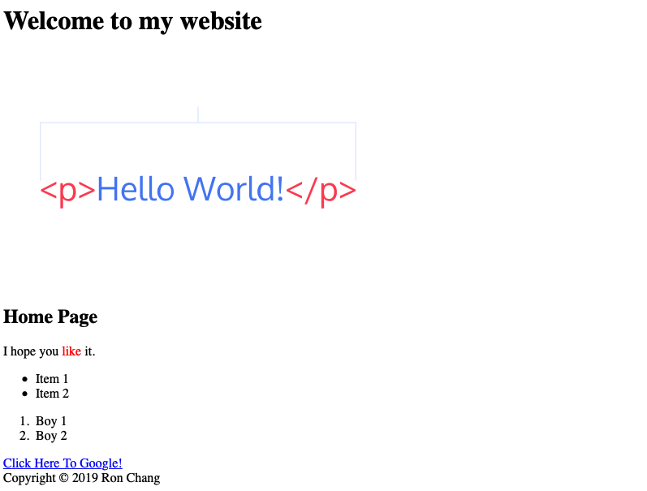

# More HTML  
<p align="right""> by <a href="https://youtu.be/KJ13lX20FqU/">Jake Wright</a></p> 

1. `block level element` `塊狀元素`:  
It always has their own space.
>`<div>` `<h1>`.  


2. `inline element` `行內元素`:  
It won't start with a new line.  
>`<b>`, `<td>`, `<a>`, ``, `<span>`.  


Sample:  
```html
<!DOCTYPE HTML>
<html>
    <head>
        <title>Hello World!</title>
    </head>

    <body>
        <div id="header">
            <h1>Welcome to my website</h1>
            
        </div>
        <div class="my-class">
            <h2 class="my-class">Home Page</h2>
            <p>I hope you <span style="color:red">like</span> it.</p>
            <ul>
                <li>Item 1</li>
                <li>Item 2</li>
            </ul>

            <ol>
                <li>Boy 1</li>
                <li>Boy 2</li>
            </ol>
        </div>
        <a href="https://google.com">Click Here To Google!</a>
        <div>
            Copyright &copy; 2019 Ron Chang
        </div>
    </body>
</html>
```
result:  
<p align="center"><br></p>  

<b>First of all</b>, We have to announce what we're writting for.  
`<!DOCTYPE HTML>`
>It is how we told browsers to undersand what is this document.  
Put it in first line berfore `<html>`.  
It's not sensitive about uppercase or lowercase.  
This is not a `<tag>`, We don't have to give it closing tag.  


#### 1. <span color:red>H</span>yperlinks and <span color:red>Ref</span>erence `超文本連結`  
`<a href="link">Content</a>`

#### 2. Disorder List `無序列表`  
`<ul></ul>`  
```html
<ul>
<li>Coffee</li>
<li>Milk</li>
</ul>
```
>result:  
+ coffee  
+ Milk  

#### 3. Order List `有序列表`  
`<ol></ol>`  
```html
<ol>
<li>Coffee</li>
<li>Milk</li>
</ol>
```
>result:  
1. Coffee  
2. Milk  


#### 4. Image `圖片`  
``  
>+ width="1920" == width="1920px"  
+ width="50" != width="50%"   

#### 5. Division `區`, Section `節`, Article `主題`, Paragraph `段落`  
`<div></div>` `<section></section>` `<article></article>` `<p></p>`  
>We use `<div>` to group elements and set up style with CSS.  
Using `<section>` to make html is readable.  
And `<article>` is for some special content.  
`<p>` is for separate the different paragraphs.  
`<span>` is a inline tag, We can give it style without break a line.  
`id` must be __unique__, but `class` don't have to.  
a. [Chinese Reference](https://www.jianshu.com/p/0c37d5d15969)
b. [English Reference](https://www.w3.org/TR/html5/sections.html#article-or-section?)  
