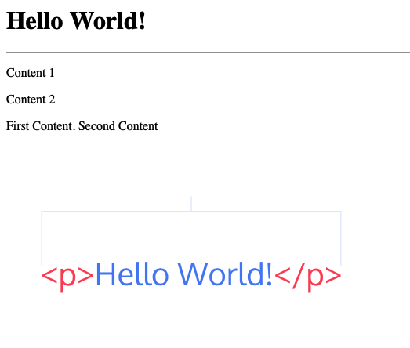

# Basic HTML  
<p align="right""> by <a href="https://youtu.be/bWPMSSsVdPk/">Jake Wright</a></p> 

<font color=#6FB4FF>HTML</font> is a markup language for browers.
We can simply separate as two main properties, `<tag>` and `content`.  
In the most situation, tags are including an opening `<tab>` and a closing `</tab>`.  

e.g  
```html
<html>
</html>
```

Basic Structure  
```html
<html>
    <head>
        <title>Hello World!</title>
    </head>

    <body>
        <h1>Hello World!</h1>
        <hr />
        <p>Content 1</p>
        <p>Content 2</p>
        <p>First Content. Second Content</p>
        
    </body>
</html>
```
result:  
<p align="center"><br></p>

We have `<h1></h1>` to `<h6></h6>` for the Title  

| `<h1>` | `<h2>` | `<h3>` | `<h4>` | `<h5>` | `<h6>` |
|--------|--------|--------|--------|--------|--------|
| <h1>h1 | <h2>h1 | <h3>h1 | <h4>h4 | <h5>h5 | <h6>h6 |

`<p></p>` stand for paragraph.  

``,`<hr />` and `<br />` working with a self-cloing.  
> [Resource LINK](https://www.zhihu.com/question/21632236) ( In Chinese )  
> `<br>` is a way to write for <font color=#6FB4FF>HTML</font>.  
> `<br/>` is a way to write not only for <font color=#BD22FF>XML</font>, but <font color=#BD22FF>XHTML1.1</font>  
> `<br />` is a way to write for <font color=#BD22FF>XHTML</font>, and compatible with <font color=#6FB4FF>HTML</font>  
> 
> First, <font color=#6FB4FF>HTML</font> coming with `<br>`, and it's not compact enough. Someone took <font color=#BD22FF>XML</font> as a reference becoming `<br />` which is the same as `<br> </br>` for <font color=#BD22FF>XHTML</font>.  

[This is where I look up for the tags](http://www.w3school.com.cn/tags/tag_hr.asp) ( In Chinese )  
