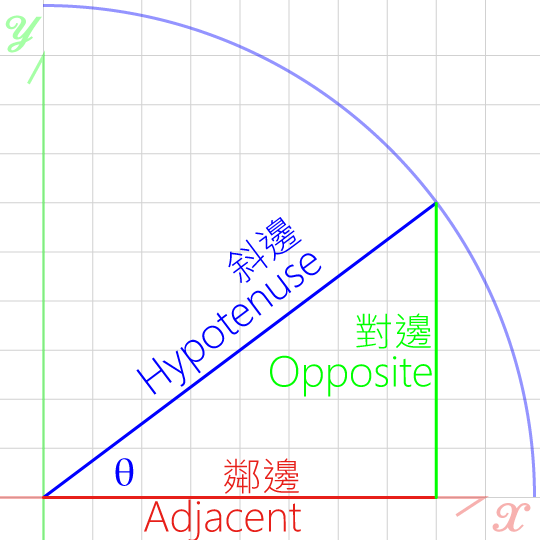
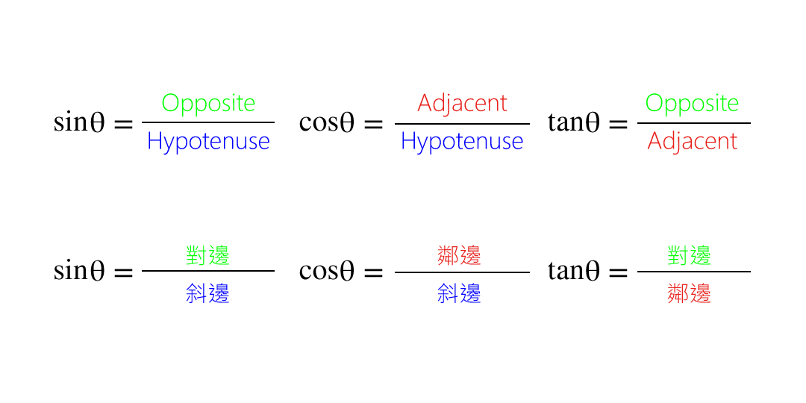
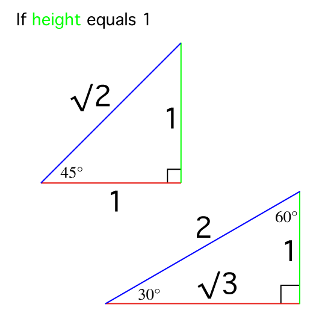
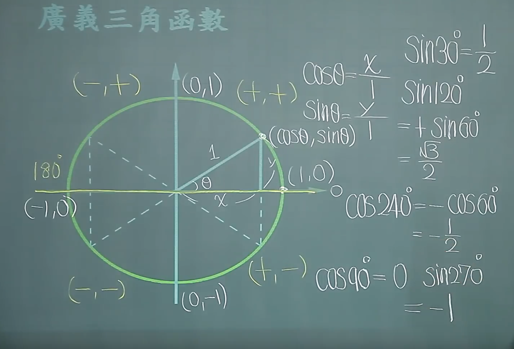
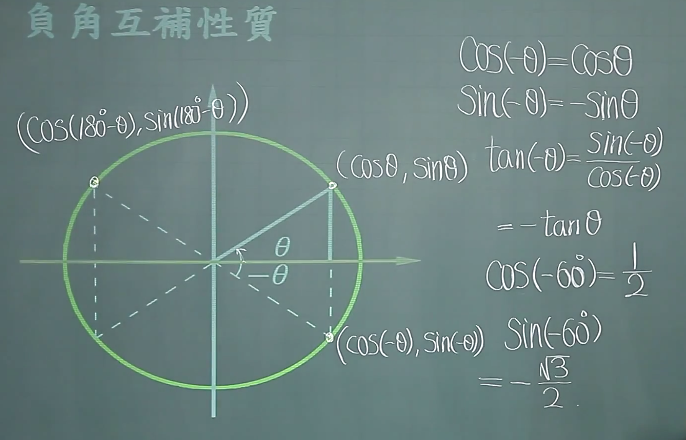

# Trigonometric Functions 三角函數  

  

  

Pythagorean theorem:
>Hypotenuse ² = Opposite ² + Adjacent ²  

Special angles:
  

<table style="width:100%; text-align:center">
<tr style="background:#A5D9FF">
    <td style="background:#F7F7F7"></td>
    <th>30°</th>
    <th>45°</th>
    <th>60°</th>
</tr>
<tr>
    <th style="background:#FD86AE">sinθ</th>
    <td>1/2</td>
    <td>√2/2</td>
    <td>√3/2</td>
</tr>
<tr>
    <th style="background:#FD86AE">cosθ</th>
    <td>√3/2</td>
    <td>√2/2</td>
    <td>1/2</td>
</tr>
<tr>
    <th style="background:#FD86AE">tanθ</th>
    <td>1/√3</td>
    <td>1</td>
    <td>√3</td>
</tr>
</table>
 

sin30° = cos60°  
sin45° = cos45°  
cos10° = sin80°  

tanθ = sinθ/cosθ  

If Hypotenuse is one.  

⎡sinθ = b/1  
⎢   => b = sinθ  
⎢  
⎢cosθ = a/1  
⎣   => a = cosθ  
=> (a,b) = (cosθ,sinθ)  

<table style="width:100%; text-align:center">
<tr style="background:#A5D9FF">
    <td style="background:#F7F7F7"></td>
    <th>30°</th>
    <th>60°</th>
    <th>90°</th>
    <th>120°</th>
    <th>180°</th>
    <th>270°</th>
</tr>
<tr>
    <th style="background:#FD86AE">sinθ</th>
    <td>1/2</td>
    <td>√2/2</td>
    <td>√3/2</td>
</tr>
<tr>
    <th style="background:#FD86AE">cosθ</th>
    <td>√3/2</td>
    <td>√2/2</td>
    <td>1/2</td>
</tr>
<tr>
    <th style="background:#FD86AE">tanθ</th>
    <td>1/√3</td>
    <td>1</td>
    <td>√3</td>
</tr>
</table>

sin120 = sin60 = √3/2  
cos120 = -cos60 = -1/2
tan120 = sin120/cos120 = -√3

sin240 = -sin60 = -cos30 = 
cos240 = -cos60 = -sin30 = 

sin180 = sin0

Reference:  
[translation](https://quizlet.com/118407284/數學-幾何-三角相關英文-flash-cards/)
[Tutorials](https://www.youtube.com/watch?v=R7dObDtw1aA&index=2&list=PLP1Ynr8cs97vn_qvkj70OfD-oijLfJtAN)
