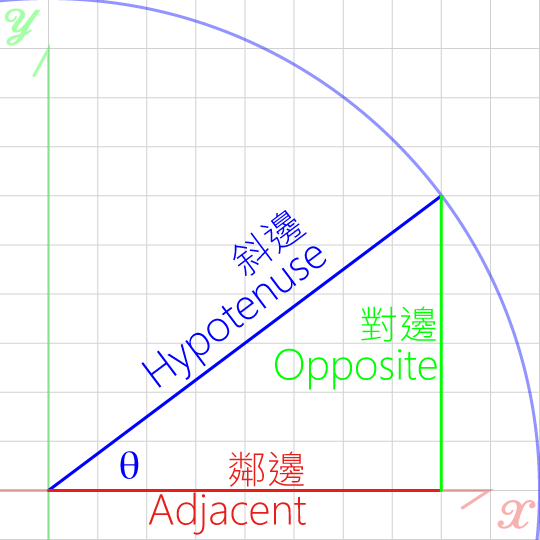

# Trigonometric Functions 三角函數  

  

  

Pythagorean theorem:
>Hypotenuse ² = Opposite ² + Adjacent ²  

Special angles:
  

|      | 30°  | 45°  | 60°  |
|------|------|------|------|
| sinθ | 1/2  | √2/2 | √3/2 |
| cosθ | √3/2 | √2/2 | 1/2  |
| tanθ | 1/√3 | 1    | √3   |

sin30° = cos60°  
sin45° = cos45°  
cos10° = sin80°  

tanθ = sinθ/cosθ  

Reference:  
[translation](https://quizlet.com/118407284/數學-幾何-三角相關英文-flash-cards/)
[Tutorials](https://www.youtube.com/watch?v=R7dObDtw1aA&index=2&list=PLP1Ynr8cs97vn_qvkj70OfD-oijLfJtAN)
