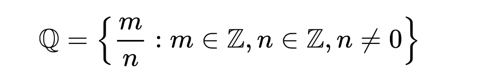

# Number 數  

  

__*"A number is a mathematical object used to `count`, `measure`, and also `label`."*__  

The original examples are the `natural numbers` 1, 2, 3, 4, and so forth.  

A notational symbol that represents a number is called a `numeral`.  

In addition to their use in counting and measuring, numerals are often used for  
- labels (as with telephone numbers)  
- ordering (as with serial numbers)  
- codes (as with ISBNs)  

In common usage, number may refer to a symbol, a word, or a mathematical abstraction.

In mathematics, the notion of number has been extended over the centuries to include:
- `0`  
- `negative numbers`  
- `rational numbers`, such as 1/2 and −2/3  
- `real numbers`, such as √2 and π  
- `complex numbers`, which extend the real numbers by adding a square root of −1.  

Calculations with numbers are done with arithmetical operations, the most familiar being `addition`, `subtraction`, `multiplication`, `division`, and `exponentiation`. Their study or usage is called `arithmetic`. The same term may also refer to number theory, the study of the properties of numbers.  

During the 19th century, mathematicians began to develop many different abstractions which share certain properties of numbers and may be seen as extending the concept. Among the first were the `hypercomplex numbers`, which consist of various extensions or modifications of the complex number system. Today, number systems are considered important special examples of much more general categories such as `rings` and `fields`, and the application of the term "number" is a matter of convention, without fundamental significance.

__*數是一個用作計數、標記或用作量度的抽象概念，是比同質或同屬性事物的等級的簡單符號記錄形式（或稱度量）*__。  

代表數的一系列符號，包括數字、運算符號等統稱為`記數系統`(numeral)。

在日常生活中，數通常出現在  
- `標記（如公路、電話和門牌號碼）`  
- `序列的指標（序列號）`  
- `代碼（ISBN）`  

在數學裡，數的定義延伸至包含如如`分數`、`負數`、`無理數`、`超越數`及`複數`等抽象化的概念。
起初人們只覺得某部分的數是數，後來隨著需要，逐步將數的概念擴大；例如畢達哥拉斯認為，數必須能用整數和整數的比表達的，後來發現無理數無法這樣表達，引起第一次數學危機，但人們漸漸接受無理數的存在，令數的概念得到擴展。  

數的算術運算（如加減乘除）在抽象代數這一數學分支內被廣義化成抽象數字系統，如`群`、`環`和`體`等。  

## ℕ 自然數 Natural Numbers  
>表示所有自然數的集合為 __ℕ__  

普遍出現在日常生活中的數即為自然數  

定義:  
>1. 正整數{1,2,3,4,...} - 多在`數論`中被使用。  
>2. 非負整數{0,1,2,3,4,...} - 多在`集合論`(Set Theory)和`電腦科學`中使用。  

在十進位數字系統裡，自然數的標記符號為0至9等十個數字，將以十為基數的進位制使用在大於九的數上。 因此，大於九的數，會有兩個或兩以上的位數。  

## ℤ 整數 Integer  
>`負整數(ℤ-)`、`正整數(ℤ+)`和`零(0)`三者即合稱為 __整數 ℤ__  

負整數是小於 0 的整數，通常在其前面加上一負號(−)，來表示其為正整數的對立。  
例如，若一個正整數是用來表示距一定點 0 右邊多少的距離，則一個負整數即表示距此定點 0 左邊多少的距離。  
相似地，若一正整數表示一銀行存款，則一負整數即表示一銀行提款。  

## ℚ 有理數 Rational Number  
>有理數(Quotient)的符號為 __ℚ__

有理數是指可以被表示成整數分子(m)和非零整數分母(n)的分數的數，即 m/n，  
其代表 1 被分做相同的n份，再取m份後的量。  
兩個不同分數可能會對應到相同的有理數，如：−10/−20 = 2/4 = 1/2。  
若m的絕對值大於n的絕對值時，其分數的絕對值會大於1。  
分數可以是`正的`、`負的`、或`零`。  
所有分數所組成的集合包含有整數，因為每一個整數都可以寫成分母為 1 的分數。  

## ℝ 實數 Real Number  
> 實數(Real)的符號為 __ℝ__

__*不嚴謹地說，實數可以和一連續的直線數線視為同一事物。*__  
實數包含所有的`有理數`和`無理數`。    
實數可以分成`正數`、`零`和`負數`。  
它是唯一的一個`完備``全序``體`。 但它不是個`代數閉域`。  
十進位數是另一種能表示數的方式。 在以十為底的數字系統內，數可以被寫成一連串的數字，在個位數右邊加上`小數點`（在美國和英國等地）或`逗號`（在歐洲大陸），`負實數`則在再前面加上一個負號。以十進位標記的有理數，其位數會一直重複或中斷。  0是唯一不能以重複位數定義的實數。  

所有`重複與中斷的十進位數`定義了`能被寫成分數的有理數`。  
>分數 5/4 能夠寫做中斷位數的十進位數1.25，也能寫做重複位數的十進位數1.24999...。  
分數 1/3 只能夠寫做 0.3333...。  

而`非重複且非中斷的十進位數`代表`不能被寫成分數的無理數`。  
>π（圓周率），表示成十進位數 3.14159265359...的實數也是無理數。  
√2都是無理數，表示成十進位數 0.101001000100001...的實數也是無理數。  

__*實數由所有能被十進位數表示的數所組成，不論其為有理數或無理數。*__  
實數可以分為[代數數](zh.wikipedia.org/wiki/代數數)和[超越數](zh.wikipedia.org/wiki/超越數)  
>- 超越數一定是無理數  
>- 有理數一定是代數數  
>其他則不一定。  

實數可以被用來表示[量度](zh.wikipedia.org/wiki/度量)，而且對應至[數線](zh.wikipedia.org/wiki/數線)上的點。  
當量度只可能精準至某一程度時，使用實數來表示量度總是會有一些誤差。  
這一問題通常以取定一適當位數的[有效數字](https://zh.wikipedia.org/wiki/有效數字)來處理。  

## ℂ 複數 Complex Number  
>複數(Complex)的符號為 __ℂ__  
>通常寫為如下形式`a+b𝒊`  

令人困惑的來源是等式 (√-1)^2 = √-1 * √-1 = -1
無法等同於 √a√b = √(ab)
這一困難最終導致他使用一特別的符號 `𝒊`來取代 √-1來警惕此一錯誤。  

棣莫弗於西元1730年完成了以他為名的著名公式，[棣莫弗定理](zh.wikipedia.org/wiki/棣莫弗公式)：  
  

而歐拉則在西元1748元完成複數分析中的[歐拉公式](zh.wikipedia.org/wiki/歐拉公式)：  
  

## 𝕀 虛數 Imaginary Number  
>虛數(Imaginary)的符號為 __𝕀__  

指`實數`以外的`複數`，其中`實部為0的虛數`稱為`純虛數`。  
而英文imaginary number的另一種定義是可以寫作`實數`與`虛數`單位 `𝒊`乘積的數，  
以此定義，__*0可視為同時是實數也是虛數*__。  

17世紀著名數學家`笛卡爾`所著《幾何學》（法語：La Géométrie）一書中，命名其為nombre imaginaire（虛構的數），成為了虛數（imaginary number）一詞的由來。

在歐拉和高斯的研究發現`虛數可對應平面上的縱軸`，與`對應平面上橫軸的實數同樣真實`。  
__*虛數軸和實數軸構成的平面稱複數平面，複數平面上每一點對應著一個複數。*__  

reference:  
[Wikipedia/Number](https://en.wikipedia.org/wiki/Number)  
[Wikipedia/數](https://zh.wikipedia.org/zh-tw/數)  
